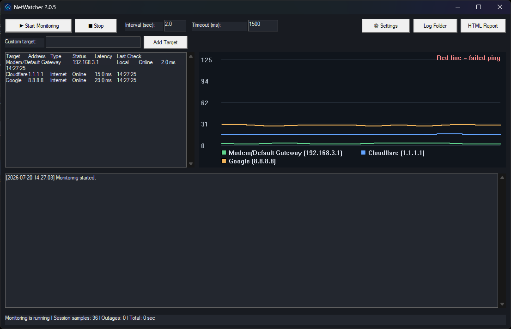

# NetWatcher

NetWatcher is a lightweight Windows internet connection monitor. It continuously checks the default gateway and public targets, records latency and packet loss, detects outages, and creates evidence that can be shared with an ISP or regulator.

[Download the latest release](../../releases/latest)



## Features

- Default gateway, Cloudflare, Google, and custom-target monitoring
- Live latency graph and failed-ping markers
- Local-network, ISP-outage, degraded-access, and high-latency classification
- CSV logs and printable HTML evidence reports
- 24-hour and 7-day statistics page
- One-click ZIP export of logs and reports
- Windows outage and recovery notifications
- Background tray mode and start-with-Windows support
- Light and dark themes
- Automatic GitHub release checks
- Per-user one-click installation with an integrated uninstaller
- No telemetry, advertising, or account requirement

## Privacy

All monitoring and report generation happen locally. NetWatcher only contacts GitHub's public releases API when automatic update checks are enabled. It does not upload ping results, browsing history, IP addresses, or log files. See [PRIVACY.md](PRIVACY.md).

## Installation

1. Open the [latest release](../../releases/latest).
2. Download `NetWatcher_Setup_<version>.exe`.
3. Double-click it and approve the installation.

The application installs for the current Windows user and does not require administrator access. Logs are stored in:

```text
Documents\NetWatcherLogs
```

Because community builds may not be code-signed, Windows SmartScreen can show an unknown-publisher warning. Official signed releases can be produced by configuring the signing secrets described in [docs/RELEASING.md](docs/RELEASING.md).

## Build from source

Requirements: Go 1.23 or newer and Windows 10/11 for runtime testing.

```powershell
./scripts/build.ps1
```

The output is written to `dist/NetWatcher_Setup_2.1.0.exe`.

## Release process

Push a semantic-version tag such as `v2.1.0`. GitHub Actions tests the project, builds the Windows setup executable, optionally signs it, generates a SHA-256 checksum, and creates a GitHub Release. GitHub Releases are intended for distributing binary assets and release notes. See [docs/RELEASING.md](docs/RELEASING.md).

## Contributing and security

Bug reports and focused pull requests are welcome. Read [CONTRIBUTING.md](CONTRIBUTING.md) before contributing. Report security issues privately as described in [SECURITY.md](SECURITY.md).

## License

MIT — see [LICENSE](LICENSE).
